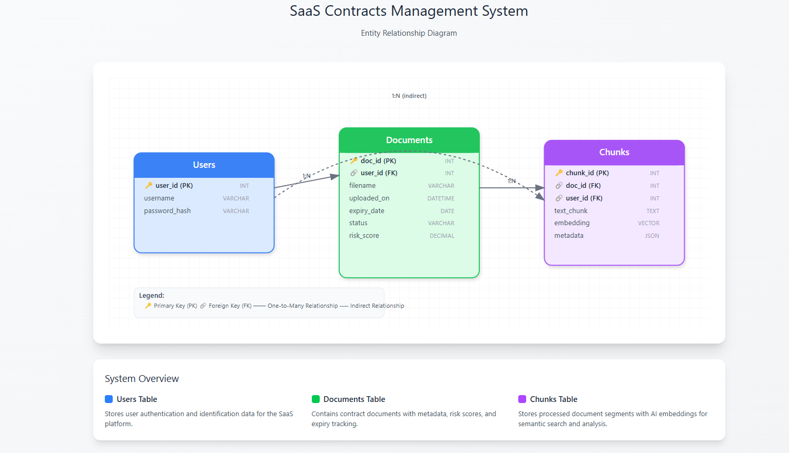

# ContractHub SaaS — Full-Stack Prototype

Business-friendly prototype to manage contracts end-to-end: upload, parse (mock), store embeddings, query with vector search, and explore insights in a dashboard.

## Live Links

- **Frontend (Vercel)**: [saasdashboard-kappa.vercel.app](https://saasdashboard-kappa.vercel.app)
- **Backend (Render)**: [contracthub.onrender.com](https://contracthub.onrender.com)

## Overview

ContractHub demonstrates a multi-tenant contracts workflow: users sign up and log in, upload PDF/TXT/DOCX contracts, a mock LlamaCloud parse produces chunks and embeddings, data is stored in Postgres + pgvector, and users run natural language queries to retrieve the most relevant snippets. A clean dashboard presents statuses, risks, and details for quick business review.

## Tech Stack

- **Frontend**: React + TypeScript + Tailwind CSS (Vite)
- **Backend**: FastAPI (Python)
- **Database**: PostgreSQL + pgvector
- **Auth**: JWT (multi-tenant isolation)
- **Deploy**: Frontend (Vercel), Backend (Render), DB (Supabase Postgres)

## Repository Structure

```
/frontend   # React + Tailwind app (Login, Dashboard, Upload, Query, Details)
/backend    # FastAPI app (auth, upload, contracts, ask)
/docs       # ER diagram and docs assets (er-diagram.png)
```

## ER Diagram



## Database Schema

- `users(user_id, username, password_hash)`
- `documents(doc_id, user_id, filename, uploaded_on, expiry_date, status, risk_score)`
- `chunks(chunk_id, doc_id, user_id, text_chunk, embedding VECTOR(8), metadata)`

## Mock LlamaCloud Response

```json
{
  "document_id": "doc123",
  "chunks": [
    {
      "chunk_id": "c1",
      "text": "Termination clause: Either party may terminate with 90 days’ notice.",
      "embedding": [0.12, -0.45, 0.91, 0.33],
      "metadata": { "page": 2, "contract_name": "MSA.pdf" }
    },
    {
      "chunk_id": "c2",
      "text": "Liability cap: Limited to 12 months’ fees.",
      "embedding": [0.01, 0.22, -0.87, 0.44],
      "metadata": { "page": 5, "contract_name": "MSA.pdf" }
    }
  ]
}
```

## Local Setup

1) Backend

```bash
cd backend
python -m venv .venv
. .venv/bin/activate  # Windows: .\.venv\Scripts\activate
pip install -r requirements.txt
export DATABASE_URL=postgresql://<user>:<pass>@<host>:5432/<db>
export SECRET_KEY=dev-secret
export EMBEDDING_DIM=8
uvicorn app.main:app --host 0.0.0.0 --port 8000 --reload
```

2) Frontend

```bash
cd frontend
npm install
VITE_API_BASE=http://localhost:8000 npm run dev
```

## Demo Steps

1. Sign up: open Login page and click “Create one”.
2. Log in: receive JWT and get redirected to Dashboard.
3. Upload: drag & drop a PDF/TXT/DOCX, track progress; unsupported types show error.
4. Dashboard: search, filter (Status/Risk), and paginate (10 rows). Color-coded risk.
5. Detail: view header metadata, clauses with confidence, insights, and evidence.
6. Query: ask a question; backend embeds the query, runs pgvector search scoped by `user_id`, and returns top relevant chunks plus a mock AI answer.

## Deployment

- Frontend: Vercel connected to this repo; auto-deploys on push.
- Backend: Render using `backend/render.yaml` (sets build/start and env vars).
- DB: Supabase Postgres with `vector` extension enabled.

## Notes

- Parsing uses a mock LlamaCloud response (see above).
- Embeddings use dimension 8 and are stored in `chunks.embedding` (pgvector).
- All reads/writes are scoped by `user_id` to ensure tenant isolation.

## Basic Tests (for reviewers)

- Auth: valid/invalid login; expired token returns 401.
- Upload: PDF/TXT/DOCX accepted; PNG rejected; progress bar during upload.
- Query: results limited to current user’s documents; relevance shows.
- UI: responsive layout; empty/loading/error states on dashboard.

—

Built for demonstration and evaluation purposes.